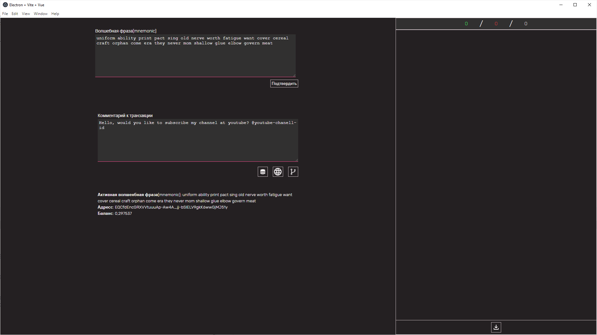
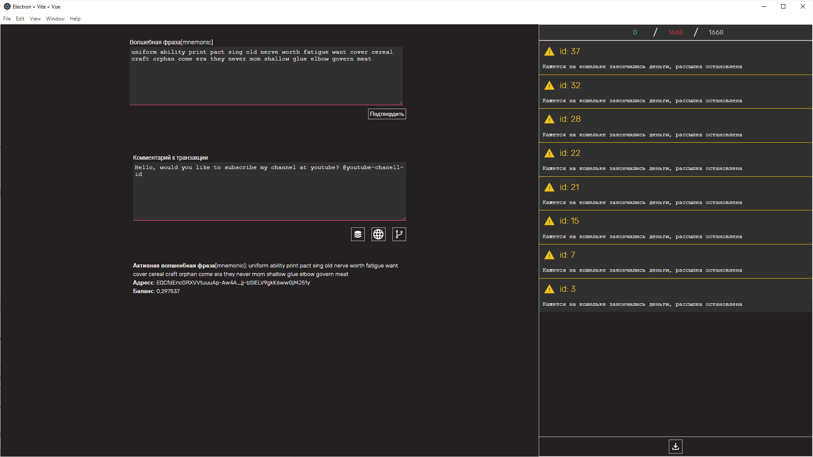

# Ton Transfers Distributor

## Description

This project is a electron based application which allows you to send transfers to random wallets in TON. It sends zero-value-transfers with payload[message]. It uses highload wallet v2 to to transactions and could create 254 transfers simultaneously. There are exists 3 mods of wallets sources for distribution - parsing[parses wallets from list of new transactions from toncenter.com api], store[stored wallets, which parsed previously] and both - store&parsing;

Additionally it shows some basic information about your wallets - address, balance, active mnemonic;

It supports only russian language.

## Demonstration

  
on start

---

  
empty balance

## Tech details

Application have been written using vue3 and electron, additionally some ton-staff like @ton/ton, @ton/crypto were used, ton-highload-wallet-contract.

Application does not have some specific architecture due to its simplicity. 

Eslint, stylelint, prettier, commitlint were configured successfully.

### How to start? 

```
1. npm i
2. npm run dev:electron
```

You could start only web version, but it is not recommended, due to electron logic(application could not work correctly without it).
